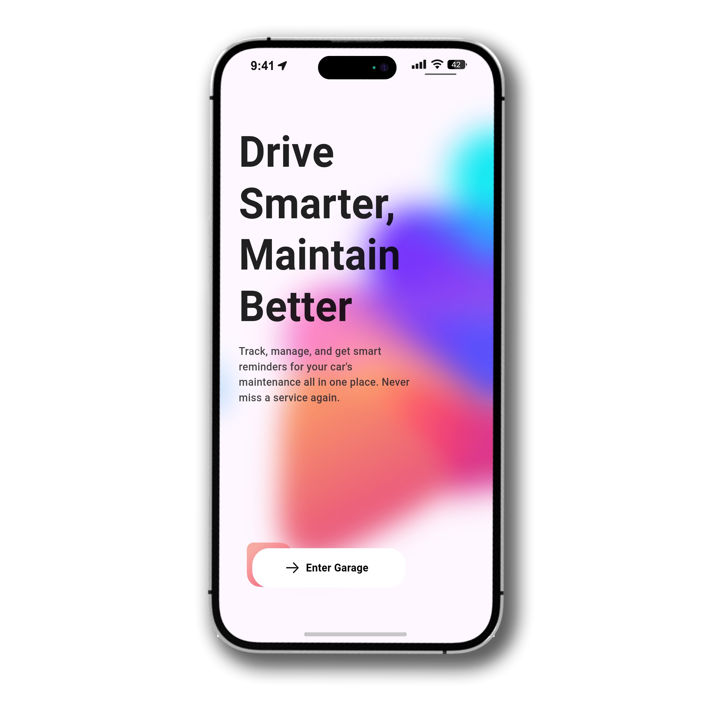
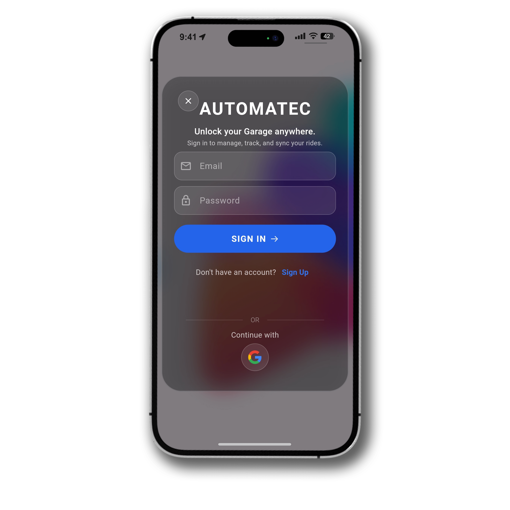
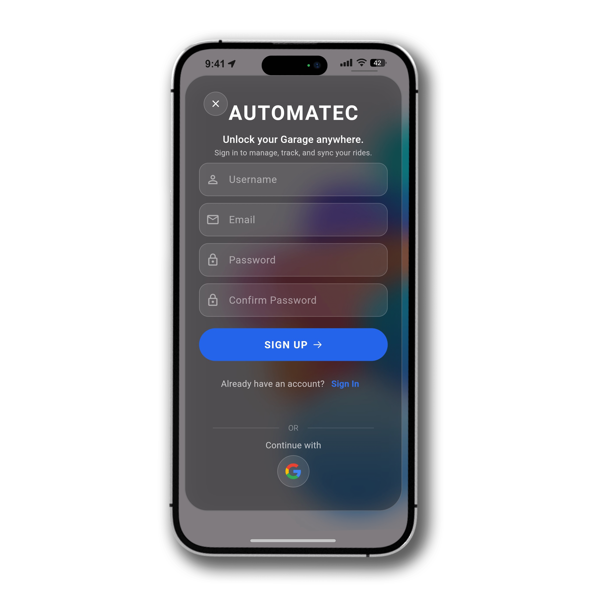
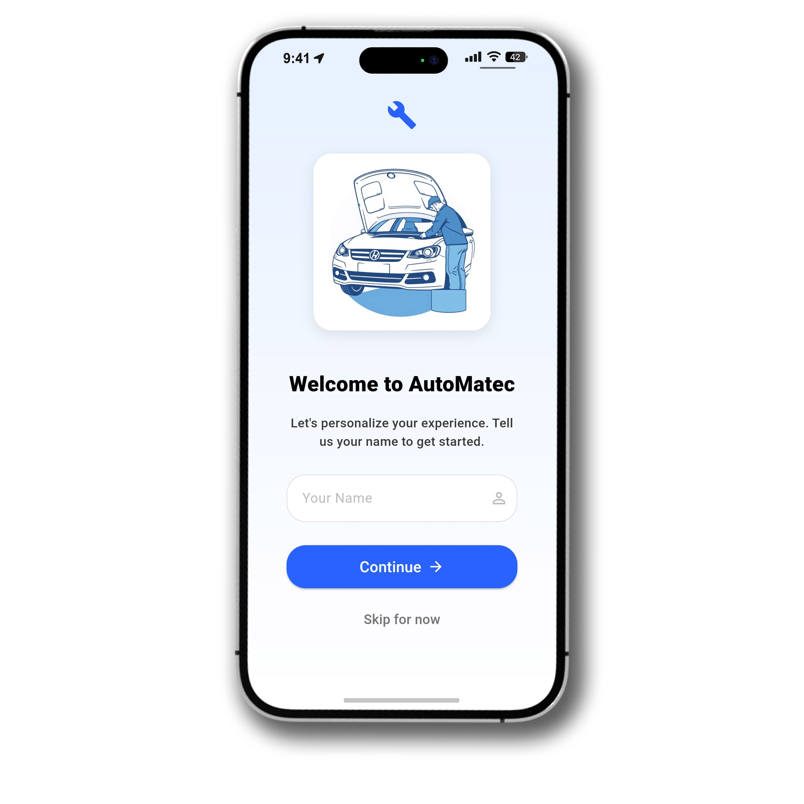
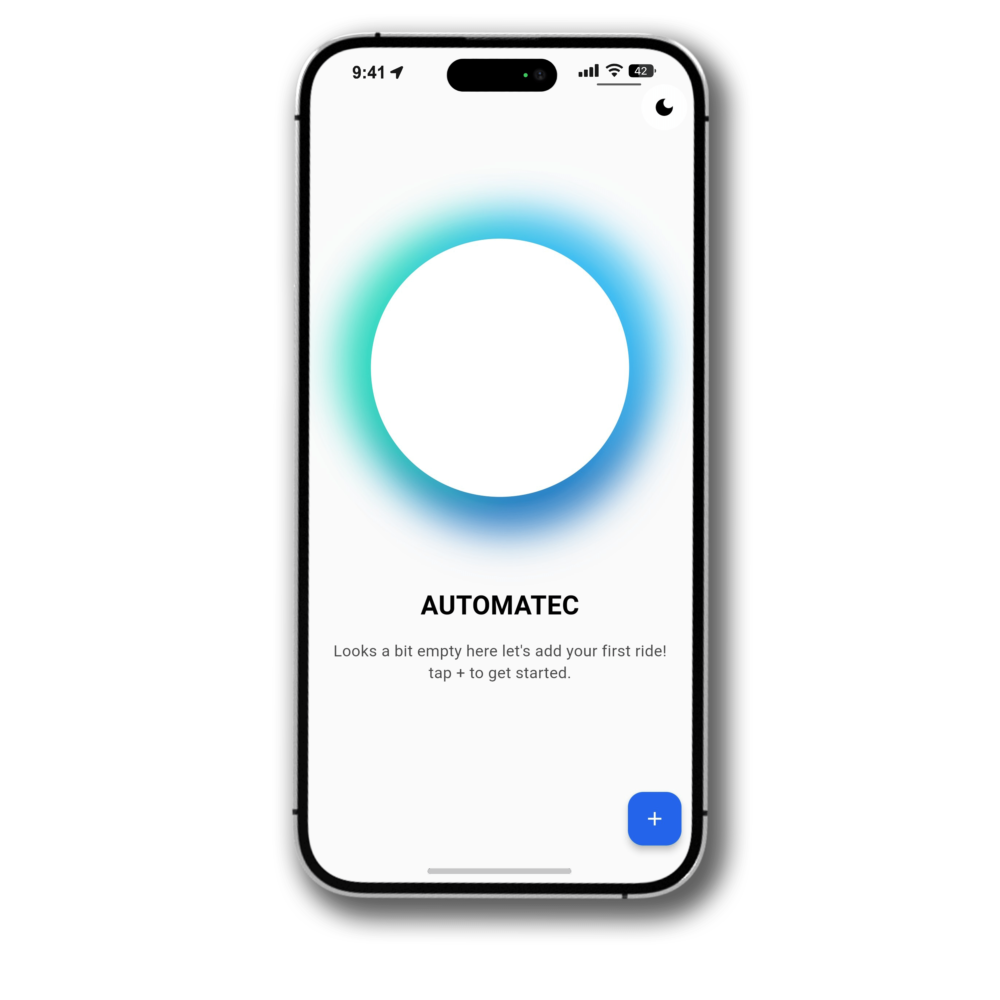
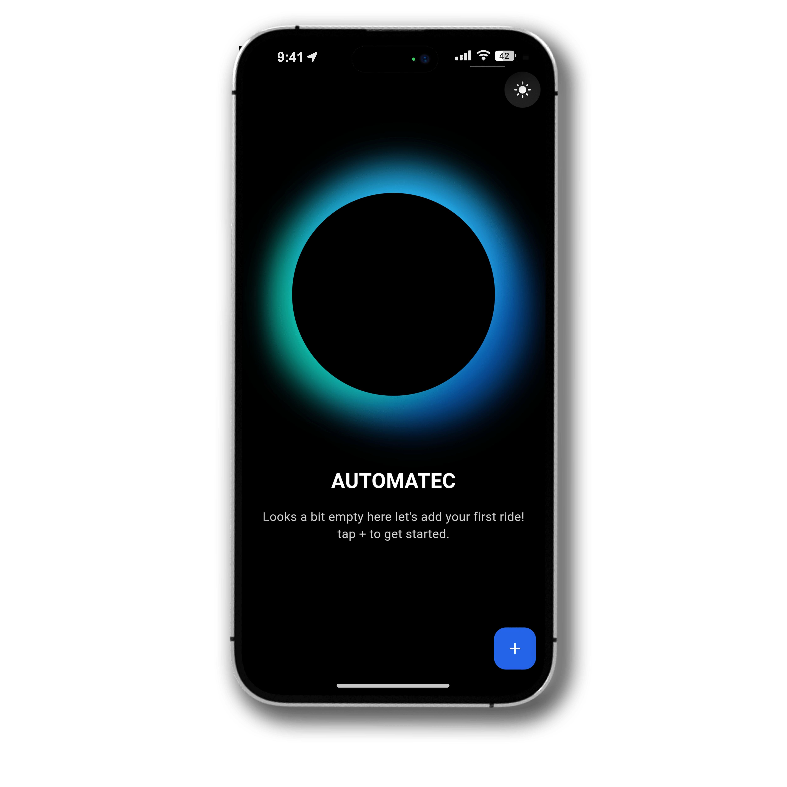
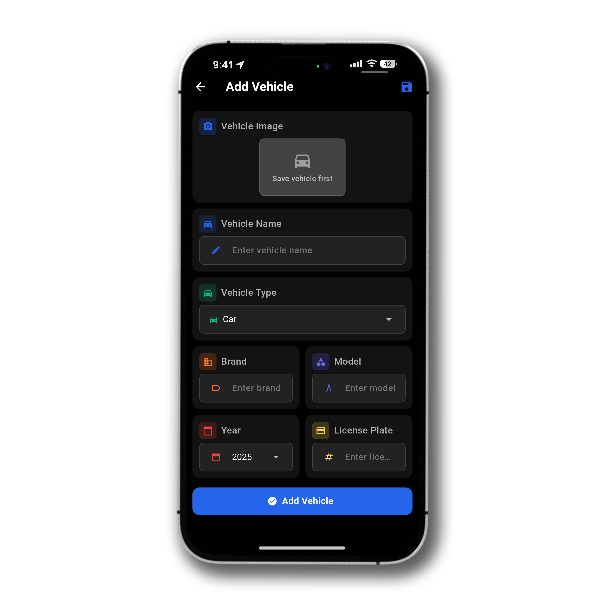
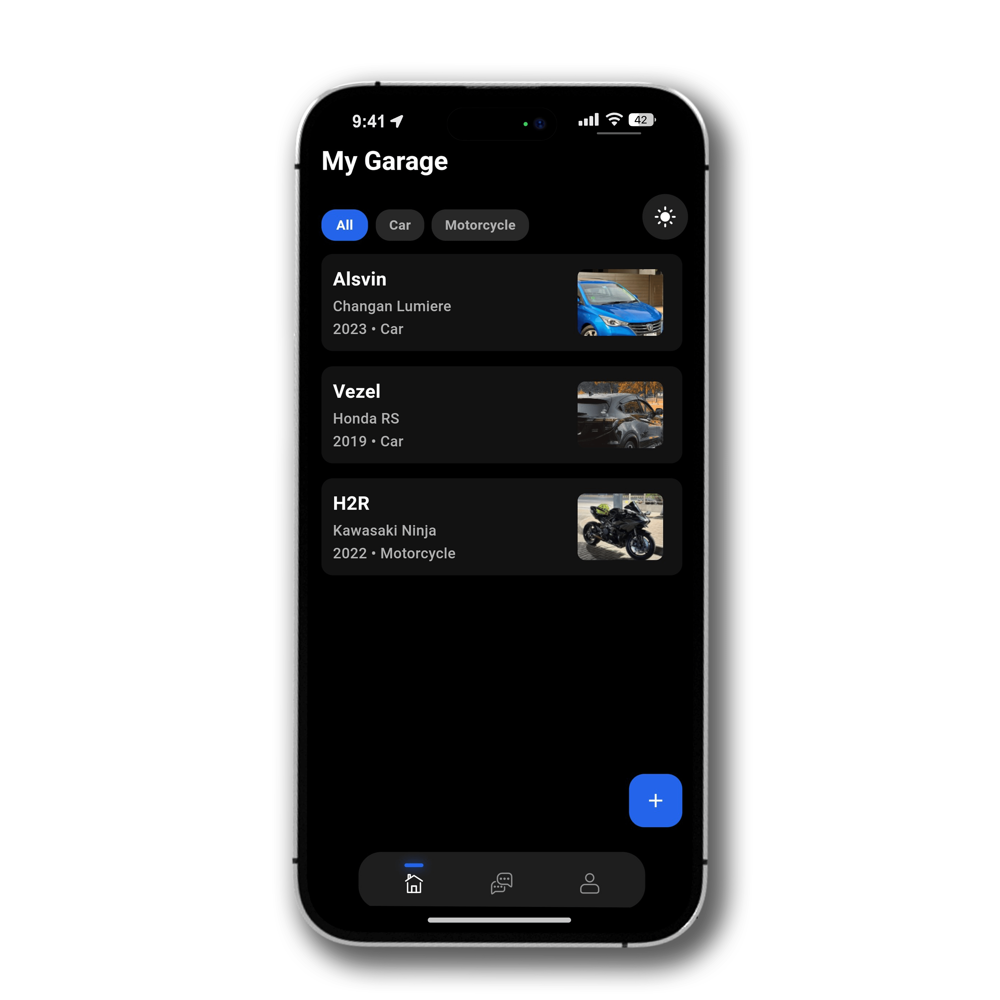
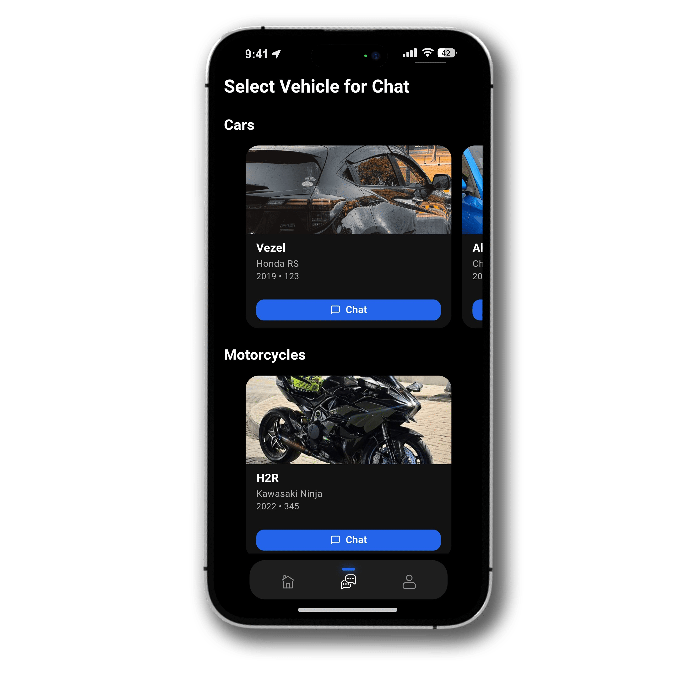
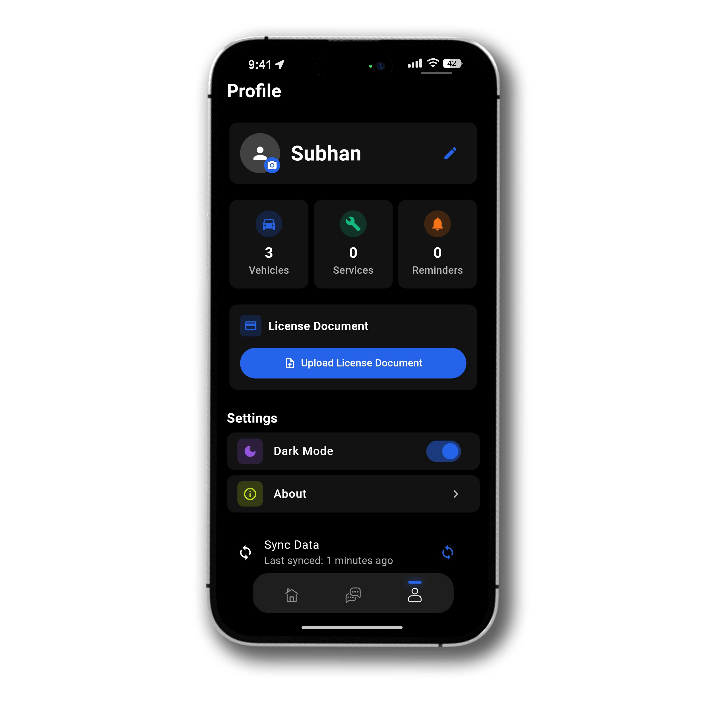

# AutoMatec


A modern, feature-rich automotive maintenance application built with Flutter that empowers vehicle owners to keep track of their maintenance history, receive timely service reminders, and get expert assistance through an AI-powered chat system.

## Project Overview

AutoMatec is designed to simplify the complex task of tracking vehicle maintenance for everyday car and motorcycle owners. The app serves as a comprehensive digital garage that keeps all vehicle maintenance records, documents, and service history in one convenient place.

**Target Users:** Vehicle owners looking for a simple yet comprehensive way to manage maintenance schedules, track service history, and get timely reminders for upcoming services.

**Supported Vehicles:** Both cars and motorcycles, with customization options for various vehicle types including SUVs, trucks, and vans.

## Core Features

### My Garage
- View all your vehicles in a clean, modern interface
- Organized display of cars and motorcycles in separate categories
- Filter and search functionality to quickly find specific vehicles
- Beautifully designed cards with vehicle images and essential information

### Add Vehicles
- Streamlined vehicle addition process with intuitive form interface
- Required fields: name, brand, model, year, license plate, and vehicle type
- Optional vehicle image upload with preview
- Year selection from a comprehensive dropdown list
- Support for multiple vehicle types: Car, Motorcycle, Truck, SUV, and Van

### Vehicle Details
- Comprehensive view of all vehicle information in a single screen
- Display of ownership documents with direct access
- Complete service history with detailed logs
- Statistical overview including total services and costs
- Quick action buttons for adding service logs and reminders

### Service Logs
- Add detailed maintenance records with service date
- Pre-filled service types (Oil Change, Tire Rotation, Brake Service) with option for custom entries
- Track maintenance costs with currency support (PKR)
- Record mileage at service time for comprehensive tracking
- Add optional notes for special circumstances or future reference

### Reminders
- Set upcoming maintenance reminders with due dates
- Mileage-based reminders for critical services
- Mark reminders as complete and convert them to service logs
- Notification system for timely maintenance alerts

### Profile Screen
- User information display and management
- License document storage and retrieval
- Authentication via Google Sign-In and email/password
- Application settings including:
  - Dark Mode toggle
  - Notification preferences
  - Language selection
  - Help & Support access

### Car Assistant
- AI-powered chat assistant for vehicle-specific queries
- Access maintenance advice tailored to your specific vehicle
- Get instant answers about service schedules and maintenance best practices
- View conversation history for future reference

### Parallax UI
- Modern, card-based UI with beautiful parallax scrolling effects
- Separate horizontal rows for cars and motorcycles categories
- Smooth animations and transitions between screens
- Responsive design that adapts to different screen sizes
- Interactive Rive animations for engaging UI elements

## App Previews

Here are some previews of AutoMatec in action:


<p align="center">
  
</p>
<p align="center">
  
</p>
<p align="center">
  
</p>
<p align="center">
  
</p>
<p align="center">
  
</p>
<p align="center">
  
</p>
<p align="center">
  
</p>
<p align="center">
  
</p>
<p align="center">
  
</p>
<p align="center">
  
</p>

## Uniqueness of AutoMatec

AutoMatec distinguishes itself from other vehicle maintenance apps through:

- **Polished Material 3 Design:** Implementing the latest Material Design standards for a modern, intuitive interface with consistent visual elements and thoughtful color schemes.

- **Immersive Parallax Scrolling:** Featuring a visually engaging parallax effect when browsing through vehicles, creating depth and enhancing the user experience.

- **Exportable Service Records:** Generate and export detailed maintenance history as PDF documents, making it easy to share with mechanics or during vehicle sales.

- **Personalized AI Assistant:** An integrated vehicle-specific chat interface that provides tailored advice and answers questions about your specific vehicle make, model, and maintenance history.

- **Seamless Document Management:** Store and access important documents like registration, insurance, and driver's license directly within the app.

- **Consistent Color-Coded Interface:** Intuitive color-coding throughout the app helps users quickly identify different types of information and sections.

- **Interactive Animations:** Engaging Rive animations for buttons, navigation, and feedback elements that make the app feel alive and responsive.

## App Structure & Flow

The application follows a logical flow to provide an intuitive user experience:

1. **Authentication:** Sign in with Google or email/password
2. **Launch Screen:** App begins with a branded splash screen
3. **Home/Garage Screen:** Displays all the user's vehicles organized by type
4. **Vehicle Details:** Tapping a vehicle opens a detailed view with maintenance history and stats
5. **Service Logs:** Add or edit maintenance records from the vehicle details screen
6. **Reminders:** Set and manage maintenance reminders with notifications
7. **Chat Assistant:** AI-powered conversation interface for vehicle-specific advice
8. **Profile:** Access user information, documents, and app settings

Navigation between main sections is handled via an intuitive bottom navigation bar with Rive animations, while detailed screens use standard navigation patterns.

## Technical Implementation

### Firebase Integration
- Authentication with Firebase Auth (Email/Password and Google Sign-In)
- Cloud Firestore Database for storing and synchronizing:
  - Vehicle information
  - Service logs
  - Service reminders
- Data sync between local SQLite database and Firestore
- Automatic background synchronization with configurable intervals
- Configured with US region to utilize the free tier benefits

### Local Features
- Flutter Local Notifications for service reminders
- PDF generation and export for service records
- Rive animations for interactive UI elements
- Responsive layouts for different screen sizes
- SQLite database for offline storage and usage

## Data Synchronization
The app implements bidirectional synchronization between the local SQLite database and Firebase Firestore:
- Tracks changes using timestamps to minimize data transfer
- Syncs automatically every 15 minutes when online
- Synchronizes immediately upon connectivity restoration
- Supports manual sync through user interface
- Handles conflict resolution based on last update time

## How to Run the App

1. Ensure you have Flutter SDK installed (version 3.7.0 or later)
2. Clone the repository
3. Create Firebase project in US region and add configuration files:
   - Place `google-services.json` in the `android/app` directory
   - Place `GoogleService-Info.plist` in the `ios/Runner` directory
4. Configure Google Sign-In by adding SHA-1 fingerprint to Firebase project
5. Install dependencies:
   ```bash
   flutter pub get
   ```
6. Run the app:
   ```bash
   flutter run
   ```

### Firebase Configuration
- Create a new Firebase project in US region (for free Spark plan benefits)
- Enable Authentication with Email/Password and Google Sign-In methods
- Create Firestore Database in US-CENTRAL1 region
- Set up appropriate security rules for Firestore
- Add Android and iOS apps to your Firebase project
- Generate and download configuration files

### Requirements
- Flutter SDK 3.7.0+
- Dart SDK 3.0.0+
- Android Studio / VS Code with Flutter extension
- Firebase project for backend services
- iOS deployment requires macOS with Xcode 14+

## Assets Used

- **Fonts:** SF Pro Display, Inter, Poppins, Manrope for clean, modern typography
- **Icons:** Material Design icons with custom color theming
- **Animations:** Rive animations for interactive elements
- **Colors:** Primary blue gradient (#2464EA, #2563EB) with complementary accent colors
- **Images:** Custom placeholder images for vehicles without photos

## Contributing

Contributions to AutoMatec are welcome! Please feel free to submit a Pull Request.

1. Fork the repository
2. Create your feature branch (`git checkout -b feature/AmazingFeature`)
3. Commit your changes (`git commit -m 'Add some AmazingFeature'`)
4. Push to the branch (`git push origin feature/AmazingFeature`)
5. Open a Pull Request

## License

This project is licensed under the MIT License - see the [LICENSE](LICENSE) file for details.

---

Developed with ❤️ using Flutter
